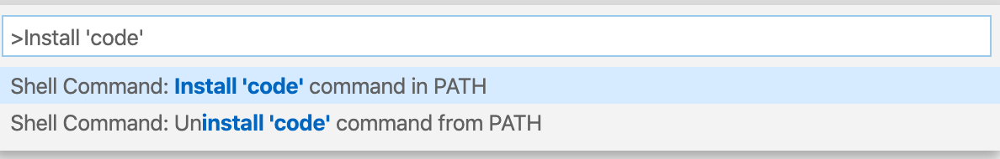

由于经常重装系统，每次配置一些开发过程中所必须的工具都要耗费一点时间。

本文就记录一下安装一些工具时候必备的一些步骤，方便日后的查阅。这里选用的工具以及偏好均为个人喜好。

### 字体

下载最新版本的 [FiraCode](https://github.com/tonsky/FiraCode/releases)，解压缩到本地文件夹。

对于 **macOS 系统**，在 ttf 文件夹下，全选所有的字体，选择 Open，然后点击 "Install Font"。

对于 **Windows 系统**，在 ttf 文件夹下，双击每一个字体文件，然后点击 Install。

### 命令行工具

命令行已经成为了开发机器不可或缺的一个重要工具，易用美观的命令行工具可以提高很多的生产力和带来很多编码的乐趣。

#### macOS

下载并安装最新版本的 [iTerm2](https://www.iterm2.com/downloads.html)。

安装最新版本的 [oh-my-zsh](https://ohmyz.sh/)。

```bash
sh -c "$(curl -fsSL https://raw.github.com/ohmyzsh/ohmyzsh/master/tools/install.sh)"
```

下载最新版本的 [dracula 主题](https://github.com/dracula/iterm/blob/master/Dracula.itermcolors)，并且在 iTerm2 中使用：
- iTerm2 > Preferences > Profiles > Colors
- 打开 Color Presets... 下拉框，选择 Import...
- 选择刚刚下载的 `Dracula.itermcolors` 文件
- 从 Color Presets 下拉框中选择 Dracula 

在 iTerm2 中，Preference >Profiles > Text 页面 Font 选择 Fira Code。

#### Windows

打开 [windows store](https://www.microsoft.com/en-us/p/windows-terminal-preview/9n0dx20hk701) 下载最新版本的 Windows Terminal。

打开 settings 页面，粘贴 Dracula 主题的 scheme:

```
{
    "background": "#282A36",
    "black": "#21222C",
    "blue": "#BD93F9",
    "brightBlack": "#6272A4",
    "brightBlue": "#D6ACFF",
    "brightCyan": "#A4FFFF",
    "brightGreen": "#69FF94",
    "brightPurple": "#FF92DF",
    "brightRed": "#FF6E6E",
    "brightWhite": "#FFFFFF",
    "brightYellow": "#FFFFA5",
    "cyan": "#8BE9FD",
    "foreground": "#F8F8F2",
    "green": "#50FA7B",
    "name": "Dracula",
    "purple": "#FF79C6",
    "red": "#FF5555",
    "white": "#F8F8F2",
    "yellow": "#F1FA8C"
}
```

然后添加到相应的命令行应用程序中去。

```
{
    // Make changes here to the cmd.exe profile
    "guid": "{0caa0dad-35be-5f56-a8ff-afceeeaa6101}",
    "name": "cmd",
    "commandline": "cmd.exe",
    "colorScheme": "Dracula",
    "fontSize": 11,
    "hidden": false
}
```

### 文本编辑器

目前最流行的当属 Visual Studio Code 了。安装完成之后，记得修改字体为 Fira Code。

#### macOS

直接 [VSCode官网][] 下载最新版本的 VS Code 即可。

默认的安装完成之后，我们需要注册 `code` 命令到命令行中。打开 VS Code，调出命令行面板(View > Command Palette)，输入 "Install 'code'"，执行完成后需要重新启动命令行。



#### Windows

直接 [VSCode官网][] 下载最新版本的 VS Code 即可。注意安装界面勾上将 `code` 添加到系统 path 的选项。

[VSCode官网]: https://code.visualstudio.com/

Windows 平台下面，一般还需要安装 Notepad++，特别是打开单个文本文件或者临时存放一些字符的时候，Notepad++ 比 VSCode 更加高效。直接 [官网](https://notepad-plus-plus.org/downloads/) 下载最新版本。

### GitHub

#### SSH

GitHub 提供两种方式来 clone 或者 push 仓库：HTTPS 和 SSH。使用 SSH 可以避免每次都输入用户名和密码。

```bash
ssh-keygen -t rsa -b 4096 -C "your comment"
```

所有选项均选择默认的值，passphrase 这一项留空（否则需要在每次 push 都输入这个）。

在 macOS 下面：

```bash
pbcopy < ~/.ssh/id_rsa.pub
# Copies the contents of the id_rsa.pub file to your clipboard
```

在 Windows(cmd) 下面：

```cmd
clip < .\.ssh\id_rsa.pub
# Copies the contents of the id_rsa.pub file to your clipboard
```

添加复制的 SSH 公钥到 [GitHub](https://github.com/settings/ssh/new)，可以在标题中填入机器名。

#### GPG

GPG 可以帮助我们对一次 git commit 进行身份的签名。

[官网](https://www.gnupg.org/download/index.html) 下载最新版本的安装包，macOS 推荐 GnuPG for OS X，Windows 推荐 Gpg4win。macOS 安装后的路径为 `/usr/local/bin/gpg2`，所以在命令行中我们需要使用 `gpg2` 命令。Windows 的版本位于 `C:\Program Files (x86)\GnuPG\bin\gpg.exe`，可以在命令行下面直接使用 `gpg` 命令。

接下来的步骤以 Windows 为例，macOS 只需要将 `gpg` 替换为 `gpg2`。

创建一个新的 key：
```bash
gpg --full-generate-key
```
一路下去均选择默认选项，输入 GitHub 的一些信息（用户名和邮箱地址），可以在 comment 中输入机器名。keysize 那里填写 4096，这是 GitHub 推荐的 RSA key 的位数，passphrase 依然留空。

查看生成的 key：

```bash
gpg --list-secret-keys --keyid-format LONG
...
sec   rsa4096/AFF6BB3742XXXXXX 2019-10-16 [SC]
      78E1EDDF17D16894B5DC5FD0AFF6BB3742XXXXXX
...
```
记下上面的 `AFF6BB3742XXXXXX`，这是我们的 key id。

```bash
gpg --armor --export AFF6BB37423A515E
-----BEGIN PGP PUBLIC KEY BLOCK-----

mQINBF2nI2gBEADD7uZagmWFMYWpbEhNNC
...
34aJFbDOqgJz37TpZMnW7fR37NLZ
=vA1l
-----END PGP PUBLIC KEY BLOCK-----
```

复制 BEGIN 那一行一直到 END，粘贴到 [GitHub 页面](https://github.com/settings/gpg/new)。

配置本地 git 应用 GPG，这里推荐使用每一次 commit 都进行 gpg 签名。

```
git config --global gpg.program gpg
git config --global gpg.program "C:\Program Files (x86)\GnuPG\bin\gpg.exe" # 只有 Windows 下面需要这一步
git config --global user.signingkey AFF6BB3742XXXXXX
git config --global commit.gpgsign true
git config --global user.name xxx
git config --global user.email xxx
```

### 访问 Linux 服务器

在本地机器创建公钥和私钥：

```bash
ssh-keygen -t ecdsa -b 521
```

按照提示每一步均使用默认选项即可。不建议改变密钥文件的名称或路径，对于自定义的密钥名称，每次连接均需要 [显示指定](https://askubuntu.com/a/30792/322580)。

拷贝公钥到远程服务器：

```bash
ssh-copy-id -i ~/.ssh/id_ecdsa user@server-ip # 指定密钥
```

输入服务器的密码之后，下次就可以直接使用 ssh user@server-ip 来 SSH 到远程服务器了，省去了每次都输入密码的麻烦。