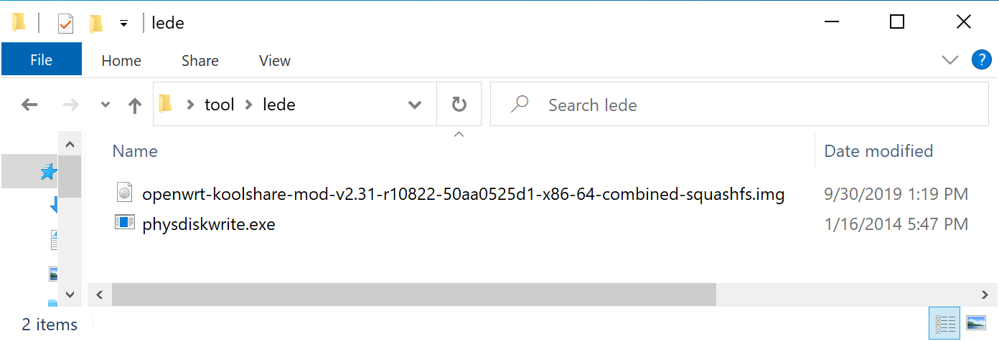
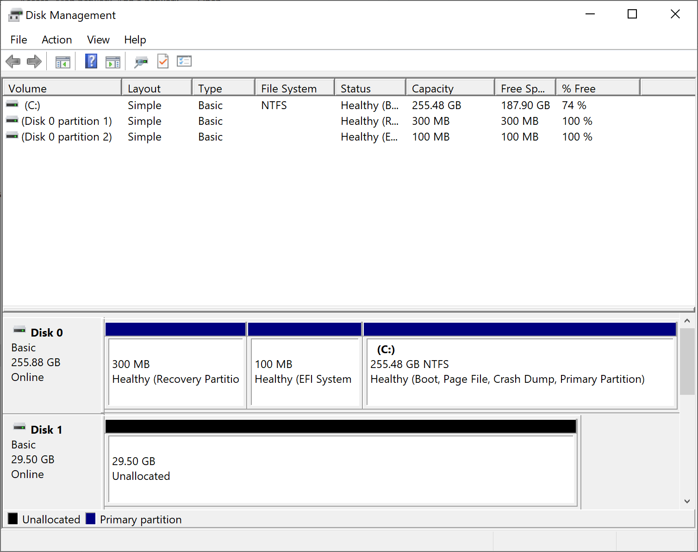
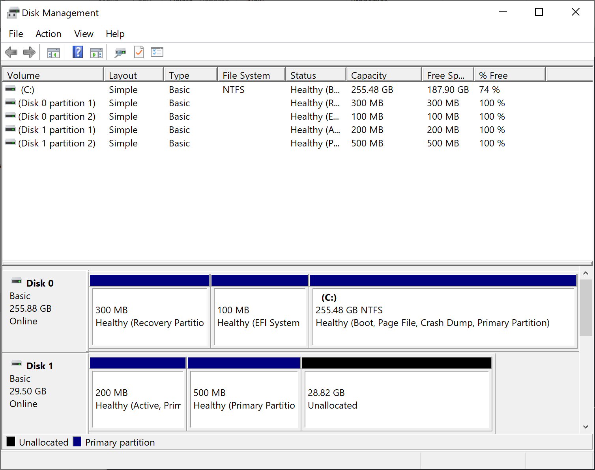
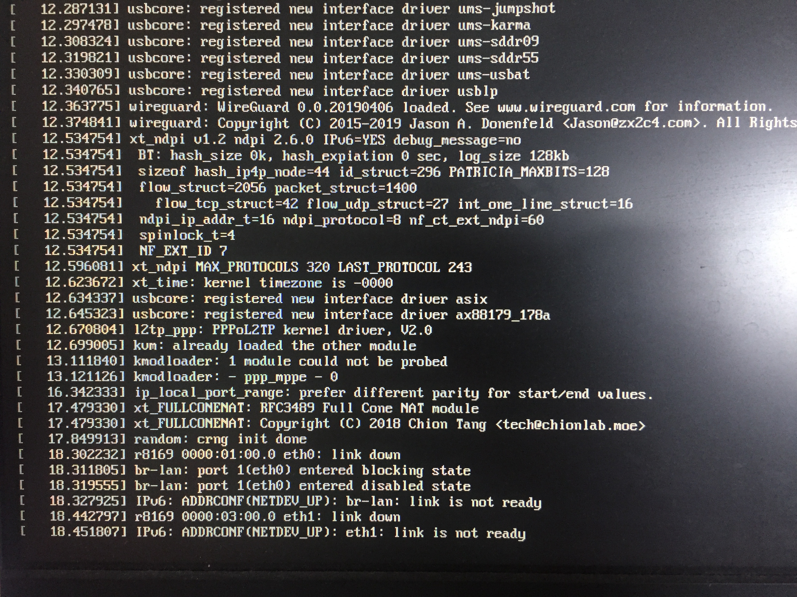

随着家庭网络的带宽越来越大，普通的家庭路由器已经不能发挥出最佳的网络性能。动辄上千的高端路由器也让我们望而却步，毕竟花个几千块钱只是用来上个网总是有点…

最合适的方案就是软路由，它以低功耗的工控主机身份，内置特定的路由器操作系统，具有非常灵活的配置选项。可以简单的看做这就是个电脑主机，也有 CPU，内存条，网卡等等。由于它的操作系统一般都是基于 Linux，所以几乎 Linux 能办到的事情，它都可以胜任，比如做一个家庭影院，或者开一个局域网文件共享，甚至 NAS 都是完全没有问题的。

本文开始记录最近一段时间捣鼓的各种过程，在此感谢朋友 [Jonny](https://www.iblogs.site/) 的帮助，我才能很快的搭好一整个系统。

首先说一下我的配置，Jonny 直接给了我他当年玩剩下的 j1900 主板，所以我不需要从硬件部分一点点起步。家里网络目前是 500Mb，有时候早上无线 wifi 下测试都可以超过这个数字。


到 [Koolshare](https://firmware.koolshare.cn/LEDE_X64_fw867/%E8%99%9A%E6%8B%9F%E6%9C%BA%E8%BD%AC%E7%9B%98%E6%88%96PE%E4%B8%8B%E5%86%99%E7%9B%98%E4%B8%93%E7%94%A8/) 下载最新的固件，以 `img.gz` 结尾的都可以，下载好后解压缩到文件夹。下载写盘工具 [physdiskwrite](https://m0n0.ch/wall/physdiskwrite.php)，为方便起见可以与 `img` 文件放置在同一个文件夹。



将主机里面的硬盘插到 windows 这台电脑上面，我的是 32GB 固态硬盘。


打开 windows 自带的 Disk management 程序，将所有分区都删掉。



打开命令行程序，`cd` 到之前的文件夹。请注意，**一定要用管理员的身份打开**，否则会看不到磁盘。

```cmd
$ cd xxx\tool\lede
$ .\physdiskwrite.exe -u .\openwrt-koolshare-mod-v2.35-r14297-5efd32232b-x86-64-generic-squashfs-combined.img

physdiskwrite v0.5.3 by Manuel Kasper <mk@neon1.net>

Searching for physical drives...

Information for \\.\PhysicalDrive0:
   Windows:       cyl: 33418  
            tpc: 255                  
            spt: 63
            
Information for \\.\PhysicalDrive1:
   Windows:       cyl: 3850
            tpc: 255                  
            spt: 63
            
Which disk do you want to write? (0..1) 1
WARNING: that disk is larger than 2 GB! Make sure you're not accidentallyoverwriting your primary hard disk! Proceeding on your own risk...About to overwrite the contents of disk 1 with new data. Proceed? (y/n) y
734527488/734527488 bytes written in total

```


接下来就可以把硬盘插回到主机上面了，开机启动。



到了这一步其实主机就已经启动完毕了，可以敲回车键进入命令行交互模式。


可以发现，系统提示我们目前网口没有插入网线。我们可以试着插入或者拔掉，来确认哪一个网口是 `eth0`，哪一个是 `eth1`，这样我们就知道哪一个口将来会是 wan 口，哪一个会是 lan 口。

编辑网络配置，设置静态 IP 以及网口的选择。

```shell
nano /etc/config/network
/etc/init.d/network restart
```


将 lan 口连接电脑，设置 IP 为 `192.168.2.xxx`，以确保与 Openwrt 在同一个网段。访问 `http://192.168.2.1`，即可打开管理界面，默认密码是 `koolshare`。


至此，整个软路由系统就可以工作起来了。你可以把主机放到弱电箱里，wan 口接光猫，lan 口再接一个硬路由来提供无线信号，这个硬路由建议设置为桥接模式（关闭 DHCP），这样家里面所有的设备都是在同一个网段里面。